# Eddy3D Component list

[{: .gh-component-selected }](/components/Select_Template/){: .GhComponentItem above-dataComment="Select Template" }
[{: .gh-component-selected }](/components/Calculated_Value/){: .GhComponentItem below-dataComment="Calculated Value" }
[{: .gh-component-selected }](/components/Calculated_Vector_Value/){: .GhComponentItem above-dataComment="Calculated Vector Value" }
[{: .gh-component-selected }](/components/Constant_Value/){: .GhComponentItem below-dataComment="Constant Value" }
[{: .gh-component-selected }](/components/Create_Address/){: .GhComponentItem above-dataComment="Create Address" }
[{: .gh-component-selected }](/components/Create_Entry_Key/){: .GhComponentItem below-dataComment="Create Entry Key" }
[{: .gh-component-selected }](/components/Create_Setting/){: .GhComponentItem above-dataComment="Create Setting" }
[{: .gh-component-selected }](/components/Debugger/){: .GhComponentItem below-dataComment="Debugger" }
[{: .gh-component-selected }](/components/Deconstruct_Entry/){: .GhComponentItem above-dataComment="Deconstruct Entry" }
[{: .gh-component-selected }](/components/Deconstruct_FileContainer/){: .GhComponentItem below-dataComment="Deconstruct FileContainer" }
[{: .gh-component-selected }](/components/Deconstruct_Setting/){: .GhComponentItem above-dataComment="Deconstruct Setting" }
[{: .gh-component-selected }](/components/Entry_from_a_Key_and_Value/){: .GhComponentItem below-dataComment="Entry from a Key and Value" }
[{: .gh-component-selected }](/components/Install_Engines/){: .GhComponentItem above-dataComment="Install Engines" }
[{: .gh-component-selected }](/components/Uniform_Value/){: .GhComponentItem below-dataComment="Uniform Value" }
[{: .gh-component-selected }](/components/Uniform_Vector_Value/){: .GhComponentItem above-dataComment="Uniform Vector Value" }
[{: .gh-component-selected }](/components/Zero_Gradient_Value/){: .GhComponentItem below-dataComment="Zero Gradient Value" }

Setup

[{: .gh-component-selected }](/components/STL_Exporter/){: .GhComponentItem above-dataComment="STL Exporter" }
[{: .gh-component-selected }](/components/Safety_Toggle/){: .GhComponentItem below-dataComment="Safety Toggle" }

Utilities

[{: .gh-component-selected }](/components/Atmospheric_Boundary_Layer/){: .GhComponentItem above-dataComment="Atmospheric Boundary Layer" }
[{: .gh-component-selected }](/components/Manual_Inflow_Profile/){: .GhComponentItem below-dataComment="Manual Inflow Profile" }
[{: .gh-component-selected }](/components/Uniform_Flow/){: .GhComponentItem above-dataComment="Uniform Flow" }
[{: .gh-component-selected }](/components/Download_Weather/){: .GhComponentItem below-dataComment="Download Weather" }
[{: .gh-component-selected }](/components/Translate_Date_To_Hours/){: .GhComponentItem above-dataComment="Translate Date To Hours" }
[{: .gh-component-selected }](/components/Wind_Compass/){: .GhComponentItem below-dataComment="Wind Compass" }
[{: .gh-component-selected }](/components/Wind_Rose_Cluster/){: .GhComponentItem above-dataComment="Wind Rose Cluster" }
[{: .gh-component-selected }](/components/Gmsh_Mesh/){: .GhComponentItem below-dataComment="Gmsh Mesh" }
[{: .gh-component-selected }](/components/Tree/){: .GhComponentItem above-dataComment="Tree" }
[{: .gh-component-selected }](/components/Watertight/){: .GhComponentItem below-dataComment="Watertight" }

Outdoor Setup

[{: .gh-component-selected }](/components/Cylinder_Domain/){: .GhComponentItem above-dataComment="Cylinder Domain" }
[{: .gh-component-selected }](/components/Cell_Size/){: .GhComponentItem below-dataComment="Cell Size" }
[{: .gh-component-selected }](/components/Mesh_Settings/){: .GhComponentItem above-dataComment="Mesh Settings" }
[{: .gh-component-selected }](/components/Refinement_Region/){: .GhComponentItem below-dataComment="Refinement Region" }
[{: .gh-component-selected }](/components/Brep_Grid_Points/){: .GhComponentItem above-dataComment="Brep Grid Points" }

Outdoor Domain Mesh

[{: .gh-component-selected }](/components/Load_Wind_Case/){: .GhComponentItem above-dataComment="Load Wind Case" }
[{: .gh-component-selected }](/components/Outdoor_Case/){: .GhComponentItem below-dataComment="Outdoor Case" }
[{: .gh-component-selected }](/components/Write_Run_Scripts/){: .GhComponentItem above-dataComment="Write Run Scripts" }

Outdoor Case

[{: .gh-component-selected }](/components/Run/){: .GhComponentItem above-dataComment="Run" }
[{: .gh-component-selected }](/components/Run_Settings/){: .GhComponentItem below-dataComment="Run Settings" }
[{: .gh-component-selected }](/components/Custom_Function_Object/){: .GhComponentItem above-dataComment="Custom Function Object" }
[{: .gh-component-selected }](/components/Clean_Case/){: .GhComponentItem below-dataComment="Clean Case" }
[{: .gh-component-selected }](/components/SLURM_Runner/){: .GhComponentItem above-dataComment="SLURM Runner" }

Outdoor Simulation

[{: .gh-component-selected }](/components/Probe/){: .GhComponentItem above-dataComment="Probe" }
[{: .gh-component-selected }](/components/Live_Residuals/){: .GhComponentItem below-dataComment="Live Residuals" }
[{: .gh-component-selected }](/components/Meshing_Progress/){: .GhComponentItem above-dataComment="Meshing Progress" }
[{: .gh-component-selected }](/components/Plot_Residuals/){: .GhComponentItem below-dataComment="Plot Residuals" }
[{: .gh-component-selected }](/components/Flow_Rates/){: .GhComponentItem above-dataComment="Flow Rates" }
[{: .gh-component-selected }](/components/Pedestrian_Wind_Comfort/){: .GhComponentItem below-dataComment="Pedestrian Wind Comfort" }
[{: .gh-component-selected }](/components/Velocity_Amplification_Factors_VAF/){: .GhComponentItem above-dataComment="Velocity Amplification Factors VAF" }
[{: .gh-component-selected }](/components/Wind_Field_Viewer/){: .GhComponentItem below-dataComment="Wind Field Viewer" }
[{: .gh-component-selected }](/components/Analysis_Period/){: .GhComponentItem above-dataComment="Analysis Period" }
[{: .gh-component-selected }](/components/Date_to_HOY/){: .GhComponentItem below-dataComment="Date to HOY" }

Outdoor Results

[{: .gh-component-selected }](/components/Indoor_Case/){: .GhComponentItem above-dataComment="Indoor Case" }
[{: .gh-component-selected }](/components/Indoor_Inlet/){: .GhComponentItem below-dataComment="Indoor Inlet" }
[{: .gh-component-selected }](/components/Indoor_Outlet/){: .GhComponentItem above-dataComment="Indoor Outlet" }
[{: .gh-component-selected }](/components/Indoor_Sink/){: .GhComponentItem below-dataComment="Indoor Sink" }
[{: .gh-component-selected }](/components/Indoor_Wall/){: .GhComponentItem above-dataComment="Indoor Wall" }
[{: .gh-component-selected }](/components/CO2_Emitter/){: .GhComponentItem below-dataComment="CO2 Emitter" }
[{: .gh-component-selected }](/components/Heat_Source/){: .GhComponentItem above-dataComment="Heat Source" }
[{: .gh-component-selected }](/components/Momentum_Source/){: .GhComponentItem below-dataComment="Momentum Source" }
[{: .gh-component-selected }](/components/Viral_Emitter/){: .GhComponentItem above-dataComment="Viral Emitter" }

Indoor

[{: .gh-component-selected }](/components/MRT_Sensors/){: .GhComponentItem above-dataComment="MRT Sensors" }
[{: .gh-component-selected }](/components/MRT_Surface/){: .GhComponentItem below-dataComment="MRT Surface" }
[{: .gh-component-selected }](/components/Surface_Settings/){: .GhComponentItem above-dataComment="Surface Settings" }
[{: .gh-component-selected }](/components/Thermal_Comfort/){: .GhComponentItem below-dataComment="Thermal Comfort" }
[{: .gh-component-selected }](/components/Tree_Settings/){: .GhComponentItem above-dataComment="Tree Settings" }
[{: .gh-component-selected }](/components/Vegetation_Settings/){: .GhComponentItem below-dataComment="Vegetation Settings" }
[{: .gh-component-selected }](/components/MRT/){: .GhComponentItem above-dataComment="MRT" }
[{: .gh-component-selected }](/components/MRT_Settings/){: .GhComponentItem below-dataComment="MRT Settings" }
[{: .gh-component-selected }](/components/Sky_Exposure/){: .GhComponentItem above-dataComment="Sky Exposure" }
[{: .gh-component-selected }](/components/UTCI_Simulation/){: .GhComponentItem below-dataComment="UTCI Simulation" }
[{: .gh-component-selected }](/components/CalcHeatIndex/){: .GhComponentItem above-dataComment="CalcHeatIndex" }
[{: .gh-component-selected }](/components/CalcPET/){: .GhComponentItem below-dataComment="CalcPET" }
[{: .gh-component-selected }](/components/UTCI_Weather/){: .GhComponentItem above-dataComment="UTCI Weather" }

MRT

[{: .gh-component-selected }](/components/FluidX3D_Run_Settings/){: .GhComponentItem above-dataComment="FluidX3D Run Settings" }
[{: .gh-component-selected }](/components/FluidX3D_Run/){: .GhComponentItem below-dataComment="FluidX3D Run" }

FluidX3D

[{: .gh-component-selected }](/components/Dataset_Reader/){: .GhComponentItem above-dataComment="Dataset Reader" }
[{: .gh-component-selected }](/components/ML_Model/){: .GhComponentItem below-dataComment="ML Model" }
[{: .gh-component-selected }](/components/Wind_Predictor/){: .GhComponentItem above-dataComment="Wind Predictor" }
[{: .gh-component-selected }](/components/Wind_Comfort_Predictor_ML/){: .GhComponentItem below-dataComment="Wind Comfort Predictor ML" }
[{: .gh-component-selected }](/components/GAN_Predict/){: .GhComponentItem above-dataComment="GAN Predict" }
[{: .gh-component-selected }](/components/Interpolate_UMag/){: .GhComponentItem below-dataComment="Interpolate UMag" }

ML

[{: .gh-component-selected }](/components/Air_Region/){: .GhComponentItem above-dataComment="Air Region" }
[{: .gh-component-selected }](/components/Building_Region/){: .GhComponentItem below-dataComment="Building Region" }
[{: .gh-component-selected }](/components/Terrain_Region/){: .GhComponentItem above-dataComment="Terrain Region" }
[{: .gh-component-selected }](/components/Vegetation_Region/){: .GhComponentItem below-dataComment="Vegetation Region" }
[{: .gh-component-selected }](/components/ABL_Condition/){: .GhComponentItem above-dataComment="ABL Condition" }
[{: .gh-component-selected }](/components/Advanced_Terrain_Mesh/){: .GhComponentItem below-dataComment="Advanced Terrain Mesh" }
[{: .gh-component-selected }](/components/Building_Mesh_Settings/){: .GhComponentItem above-dataComment="Building Mesh Settings" }
[{: .gh-component-selected }](/components/Terrain_Mesh_Settings/){: .GhComponentItem below-dataComment="Terrain Mesh Settings" }
[{: .gh-component-selected }](/components/Vegetation_Mesh_Settings/){: .GhComponentItem above-dataComment="Vegetation Mesh Settings" }
[{: .gh-component-selected }](/components/Building_Material/){: .GhComponentItem below-dataComment="Building Material" }
[{: .gh-component-selected }](/components/Soil_Material/){: .GhComponentItem above-dataComment="Soil Material" }
[{: .gh-component-selected }](/components/Terrain_Surface_Material/){: .GhComponentItem below-dataComment="Terrain Surface Material" }
[{: .gh-component-selected }](/components/Vegetation_Properties/){: .GhComponentItem above-dataComment="Vegetation Properties" }
[{: .gh-component-selected }](/components/Grass/){: .GhComponentItem below-dataComment="Grass" }

Outdoor+ Regions

[{: .gh-component-selected }](/components/Outdoor+_Case/){: .GhComponentItem above-dataComment="Outdoor+ Case" }
[{: .gh-component-selected }](/components/Box_Domain/){: .GhComponentItem below-dataComment="Box Domain" }
[{: .gh-component-selected }](/components/Relative_Humidity/){: .GhComponentItem above-dataComment="Relative Humidity" }
[{: .gh-component-selected }](/components/Simulation_Mesh_Settings/){: .GhComponentItem below-dataComment="Simulation Mesh Settings" }
[{: .gh-component-selected }](/components/Simulation_Settings/){: .GhComponentItem above-dataComment="Simulation Settings" }
[{: .gh-component-selected }](/components/Timing_Parameters/){: .GhComponentItem below-dataComment="Timing Parameters" }
[{: .gh-component-selected }](/components/Weather/){: .GhComponentItem above-dataComment="Weather" }
[{: .gh-component-selected }](/components/CheckMesh/){: .GhComponentItem below-dataComment="CheckMesh" }
[{: .gh-component-selected }](/components/Check_Geometry/){: .GhComponentItem above-dataComment="Check Geometry" }
[{: .gh-component-selected }](/components/Parse_Case_Logs/){: .GhComponentItem below-dataComment="Parse Case Logs" }
[{: .gh-component-selected }](/components/ViewFactors/){: .GhComponentItem above-dataComment="ViewFactors" }
[{: .gh-component-selected }](/components/Deconstruct_Weather/){: .GhComponentItem below-dataComment="Deconstruct Weather" }
[{: .gh-component-selected }](/components/Case_Run/){: .GhComponentItem above-dataComment="Case Run" }
[{: .gh-component-selected }](/components/OpenFOAM_Dictionary/){: .GhComponentItem below-dataComment="OpenFOAM Dictionary" }
[{: .gh-component-selected }](/components/OpenFOAM_List/){: .GhComponentItem above-dataComment="OpenFOAM List" }
[{: .gh-component-selected }](/components/Read_OpenFOAM_Case/){: .GhComponentItem below-dataComment="Read OpenFOAM Case" }

Outdoor+ Simulation

[{: .gh-component-selected }](/components/Export_to_Visualizer/){: .GhComponentItem above-dataComment="Export to Visualizer" }
[{: .gh-component-selected }](/components/Open_In_ParaView/){: .GhComponentItem below-dataComment="Open In ParaView" }
[{: .gh-component-selected }](/components/Deconstruct_Case/){: .GhComponentItem above-dataComment="Deconstruct Case" }
[{: .gh-component-selected }](/components/Deconstruct_Region/){: .GhComponentItem below-dataComment="Deconstruct Region" }
[{: .gh-component-selected }](/components/Face_Warnings/){: .GhComponentItem above-dataComment="Face Warnings" }
[{: .gh-component-selected }](/components/Read_Cells/){: .GhComponentItem below-dataComment="Read Cells" }
[{: .gh-component-selected }](/components/Read_checkMesh/){: .GhComponentItem above-dataComment="Read checkMesh" }
[{: .gh-component-selected }](/components/Create_Mesh/){: .GhComponentItem below-dataComment="Create Mesh" }
[{: .gh-component-selected }](/components/Create_OBJ/){: .GhComponentItem above-dataComment="Create OBJ" }
[{: .gh-component-selected }](/components/Cull_Ground_Mesh/){: .GhComponentItem below-dataComment="Cull Ground Mesh" }

Post

## 00 Setup
#### Main Components

    <a href="components/Select_Template.md" style="text-decoration: none;">
        

            

                 Select Template
            

            
Load example Grasshopper definitions for common workflows.
 
 Templates include microclimate simulations, outdoor comfort studies,
 and CFD analysis setups.
 
 Version: 1.0.1.827

        

    </a>
    <a href="components/Calculated_Value.md" style="text-decoration: none;">
        

            

                 Calculated Value
            

            
Create a calculated scalar Value.

        

    </a>
    <a href="components/Calculated_Vector_Value.md" style="text-decoration: none;">
        

            

                 Calculated Vector Value
            

            
Create a calculated vector Value.

        

    </a>
    <a href="components/Constant_Value.md" style="text-decoration: none;">
        

            

                 Constant Value
            

            
Create a constant scalar Value.

        

    </a>
    <a href="components/Create_Address.md" style="text-decoration: none;">
        

            

                 Create Address
            

            
Create a MetaFOAM Address for entries and settings.

        

    </a>
    <a href="components/Create_Entry_Key.md" style="text-decoration: none;">
        

            

                 Create Entry Key
            

            
Create a MetaFOAM EntryKey from key segments.

        

    </a>
    <a href="components/Create_Setting.md" style="text-decoration: none;">
        

            

                 Create Setting
            

            
Create a Setting from a list of entries.

        

    </a>
    <a href="components/Debugger.md" style="text-decoration: none;">
        

            

                 Debugger
            

            
Internal debugging helper (not for general use).

        

    </a>
    <a href="components/Deconstruct_Entry.md" style="text-decoration: none;">
        

            

                 Deconstruct Entry
            

            
Deconstructs an Entry instance.

        

    </a>
    <a href="components/Deconstruct_FileContainer.md" style="text-decoration: none;">
        

            

                 Deconstruct FileContainer
            

            
Deconstructs a FileContainer instance.

        

    </a>
    <a href="components/Deconstruct_Setting.md" style="text-decoration: none;">
        

            

                 Deconstruct Setting
            

            
Deconstruct a Setting instance into its entries.

        

    </a>
    <a href="components/Entry_from_a_Key_and_Value.md" style="text-decoration: none;">
        

            

                 Entry from a Key and Value
            

            
Create an Entry from address, key, and value (not yet implemented).

        

    </a>
    <a href="components/Install_Engines.md" style="text-decoration: none;">
        

            

                 Install Engines
            

            
Downloads and installs Radiance and EnergyPlus v9.4.0 (MRT + UTCI pipeline), and clones the FluidX3D GPU solver source.

        

    </a>
    <a href="components/Uniform_Value.md" style="text-decoration: none;">
        

            

                 Uniform Value
            

            
Create a uniform scalar Value.

        

    </a>
    <a href="components/Uniform_Vector_Value.md" style="text-decoration: none;">
        

            

                 Uniform Vector Value
            

            
Create a uniform vector Value.

        

    </a>
    <a href="components/Zero_Gradient_Value.md" style="text-decoration: none;">
        

            

                 Zero Gradient Value
            

            
Create a zeroGradient Value.

        

    </a>

## 00 Utilities
#### Main Components

    <a href="components/STL_Exporter.md" style="text-decoration: none;">
        

            

                 STL Exporter
            

            
Export geometry to STL format for OpenFOAM or other CFD tools. Supports meshes and Breps (auto-meshed); binary or ASCII, single or multiple files.

        

    </a>
    <a href="components/Safety_Toggle.md" style="text-decoration: none;">
        

            

                 Safety Toggle
            

            
A boolean toggle that is always FALSE when a file is opened. Useful for preventing automatic execution of heavy ML models. Double-click to toggle.

        

    </a>

## 01 Outdoor Setup
#### Main Components

    <a href="components/Atmospheric_Boundary_Layer.md" style="text-decoration: none;">
        

            

                 Atmospheric Boundary Layer
            

            
Define atmospheric boundary layer inflow conditions for Eddy3D.

        

    </a>
    <a href="components/Manual_Inflow_Profile.md" style="text-decoration: none;">
        

            

                 Manual Inflow Profile
            

            
Define inflow boundary conditions from a manually entered vertical profile (z/zR, U/UR, k/UR^2) instead of the parametric ABL log-law. Writes fixedProfile inlet conditions for U, k and epsilon. epsilon is derived from the profile as epsilon(z) = Cmu^0.5 * k(z) * d(U)/dz.

        

    </a>
    <a href="components/Uniform_Flow.md" style="text-decoration: none;">
        

            

                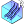 Uniform Flow
            

            
Create a uniform (constant velocity) inflow boundary condition for Eddy3D.

        

    </a>
    <a href="components/Download_Weather.md" style="text-decoration: none;">
        

            

                 Download Weather
            

            
Download an EPW weather file from climate.onebuilding.org nearest to your project location. Use the Search input to filter by station name, WMO ID, or dataset year.

        

    </a>
    <a href="components/Translate_Date_To_Hours.md" style="text-decoration: none;">
        

            

                 Translate Date To Hours
            

            
Translate a Ladybug analysis period to hours of the year.

        

    </a>
    <a href="components/Wind_Compass.md" style="text-decoration: none;">
        

            

                 Wind Compass
            

            
Visualize a wind direction on a compass circle. Direction is meteorological degrees (0=N, 90=E, 180=S, 270=W); outputs the flow vector and the 16-point cardinal name.

        

    </a>
    <a href="components/Wind_Rose_Cluster.md" style="text-decoration: none;">
        

            

                 Wind Rose Cluster
            

            
Cluster annual wind directions into representative directions using k-means.

        

    </a>
    <a href="components/Gmsh_Mesh.md" style="text-decoration: none;">
        

            

                 Gmsh Mesh
            

            
Creates a STL mesh from geometry using the gmsh application. Useful to create healthy mesh topologies for building elements.

        

    </a>
    <a href="components/Tree.md" style="text-decoration: none;">
        

            

                 Tree
            

            
Represents a tree as a porous zone for wind blocking (Darcy-Forchheimer). Feed into the wind case component.

        

    </a>
    <a href="components/Watertight.md" style="text-decoration: none;">
        

            

                 Watertight
            

            
Combine a multi-part building mesh into a single watertight, CFD-ready solid via the bundled Python mesh service (trimesh/manifold3d/pymeshfix). The server auto-starts locally on the first run (uv-managed Python environment; first start installs it, 1-2 minutes) and is reused afterwards.

        

    </a>

## 02 Outdoor Domain Mesh
#### Main Components

    <a href="components/Cylinder_Domain.md" style="text-decoration: none;">
        

            

                 Cylinder Domain
            

            
Define a cylindrical simulation domain for Eddy3D. One cylindrical mesh serves all wind directions; the cylinder side faces switch between inlet and outlet per direction.

        

    </a>
    <a href="components/Cell_Size.md" style="text-decoration: none;">
        

            

                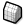 Cell Size
            

            
Compute the snappyHexMesh refinement level needed to reach a target cell size (each level halves the cell size).

        

    </a>
    <a href="components/Mesh_Settings.md" style="text-decoration: none;">
        

            

                 Mesh Settings
            

            
Configure mesh refinement, layers, and grading for Eddy3D.

        

    </a>
    <a href="components/Refinement_Region.md" style="text-decoration: none;">
        

            

                 Refinement Region
            

            
Add a custom snappyHexMesh refinement region (a box, solid or surface) to a written case's mesh, then re-mesh. Refines the cells inside/near the geometry to the chosen level.

        

    </a>
    <a href="components/Brep_Grid_Points.md" style="text-decoration: none;">
        

            

                 Brep Grid Points
            

            
Generate a regular point grid on Brep, surface, or mesh geometry.

        

    </a>

## 03 Outdoor Case
#### Main Components

    <a href="components/Load_Wind_Case.md" style="text-decoration: none;">
        

            

                 Load Wind Case
            

            
Reference an existing wind case folder (mesh/ + case_NNN) for post-processing.

        

    </a>
    <a href="components/Outdoor_Case.md" style="text-decoration: none;">
        

            

                 Outdoor Case
            

            
Create, write, and manage an Eddy3D outdoor wind simulation case.

        

    </a>
    <a href="components/Write_Run_Scripts.md" style="text-decoration: none;">
        

            

                 Write Run Scripts
            

            
Writes meshing and simulation scripts (.bat / .sh) into a Scripts/ folder under the wind study, so the workflow can be launched manually outside Grasshopper. The scripts match what the Run component executes. Write the study to disk first (Wind Case 'Write').

        

    </a>

## 04 Outdoor Simulation
#### Main Components

    <a href="components/Run.md" style="text-decoration: none;">
        

            

                 Run
            

            
Mesh and run an OpenFOAM case on the selected engine (wind / indoor / UMF).

        

    </a>
    <a href="components/Run_Settings.md" style="text-decoration: none;">
        

            

                 Run Settings
            

            
Configure solver run controls for Eddy3D.

        

    </a>
    <a href="components/Custom_Function_Object.md" style="text-decoration: none;">
        

            

                 Custom Function Object
            

            
Inject a custom OpenFOAM function object into a written case so the solver runs it at runtime — fieldAverage, yPlus, wallShearStress, forces, surfaceFieldValue, a coded FO, etc.

        

    </a>
    <a href="components/Clean_Case.md" style="text-decoration: none;">
        

            

                 Clean Case
            

            
Delete mesh and/or simulation result directories from a wind study folder.

        

    </a>

#### Hidden Components

    <a href="components/SLURM_Runner.md" style="text-decoration: none;">
        

            

                 SLURM Runner
            

            
Write SLURM batch (sbatch) files to run a wind study on an HPC cluster.

        

    </a>

## 05 Outdoor Results
#### Main Components

    <a href="components/Probe.md" style="text-decoration: none;">
        

            

                 Probe
            

            
Sample fields at points on a solved case, post-hoc. With Run it writes a probes function and runs postProcess on the latest time, then reads the results; without Run it reads existing results. Works on a wind case (one sub-result per direction) or a loaded case.

        

    </a>
    <a href="components/Live_Residuals.md" style="text-decoration: none;">
        

            

                 Live Residuals
            

            
Draws a wind case's residual convergence directly on the Grasshopper canvas, with lightweight timed updates. Wire the case and toggle 'Live' to monitor a running simulation without an external plotter window. When a warm-up ramp is enabled the solver restarts mid-run and writes a separate residual file per phase; all phases are stitched into one continuous curve so you see the full history (warm-up + main), not just the latest phase.

        

    </a>
    <a href="components/Meshing_Progress.md" style="text-decoration: none;">
        

            

                 Meshing Progress
            

            
Monitor blockMesh, surfaceFeatures, and snappyHexMesh progress from the mesh case logs.

        

    </a>
    <a href="components/Plot_Residuals.md" style="text-decoration: none;">
        

            

                 Plot Residuals
            

            
Open the web-based residual plotter for a wind case's convergence history (one trace per direction).

        

    </a>
    <a href="components/Flow_Rates.md" style="text-decoration: none;">
        

            

                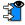 Flow Rates
            

            
Compute volumetric flow rates (m³/s) across a mesh, treating its vertices as velocity probes. Per face: average vertex velocities × face area × cos(angle to face normal).

        

    </a>
    <a href="components/Pedestrian_Wind_Comfort.md" style="text-decoration: none;">
        

            

                 Pedestrian Wind Comfort
            

            
Classifies pedestrian wind comfort per point from an annual hourly wind-speed series (the Wind Speed output of the Velocity Amplification Factors (VAF) component) against a comfort criterion (Lawson, Davenport, NEN8100). Returns the comfort category, class letter, and activity description for each point.

        

    </a>
    <a href="components/Velocity_Amplification_Factors_VAF.md" style="text-decoration: none;">
        

            

                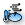 Velocity Amplification Factors VAF
            

            
Compute Velocity Amplification Factors (VAF) and annual wind speed at probes from CFD results and EPW weather data. VAF (the term used in the wind-engineering literature for what Eddy3D historically called "wind factors") is the local wind speed normalized by the reference speed.

        

    </a>
    <a href="components/Wind_Field_Viewer.md" style="text-decoration: none;">
        

            

                 Wind Field Viewer
            

            
Visualize a probed wind field: colored velocity arrows, a point cloud, a heatmap mesh, streamlines, or volumetric smoke (pick via Display Mode). Feed the Probe component's points + velocity vectors (Field = U), or any points + vectors.

        

    </a>
    <a href="components/Analysis_Period.md" style="text-decoration: none;">
        

            

                 Analysis Period
            

            
Define an analysis period (from/to day of year, start/end hour of day) and output the hour-of-year indices it covers, for filtering annual results.

        

    </a>
    <a href="components/Date_to_HOY.md" style="text-decoration: none;">
        

            

                 Date to HOY
            

            
Convert a date and time (month, day, hour) into a single hour-of-year integer (1–8760), for indexing annual hourly data.

        

    </a>

## 06 Indoor
#### Main Components

    <a href="components/Indoor_Case.md" style="text-decoration: none;">
        

            

                 Indoor Case
            

            
Build an isothermal indoor ventilation case (room + inlets + outlets + sinks) for OpenFOAM 12.

        

    </a>
    <a href="components/Indoor_Inlet.md" style="text-decoration: none;">
        

            

                 Indoor Inlet
            

            
Ventilation inlet — defines where air enters the room (diffuser, window, door). Direction is computed perpendicular to the surface, pointing into the room.

        

    </a>
    <a href="components/Indoor_Outlet.md" style="text-decoration: none;">
        

            

                 Indoor Outlet
            

            
Ventilation outlet — defines where air exhausts from the room (return grille, open window).

        

    </a>
    <a href="components/Indoor_Sink.md" style="text-decoration: none;">
        

            

                 Indoor Sink
            

            
A Darcy-Forchheimer momentum sink (filter/screen) box for an indoor ventilation case.

        

    </a>
    <a href="components/Indoor_Wall.md" style="text-decoration: none;">
        

            

                 Indoor Wall
            

            
Set the indoor wall temperature (°C) for the transported temperature field.

        

    </a>
    <a href="components/CO2_Emitter.md" style="text-decoration: none;">
        

            

                 CO2 Emitter
            

            
A CO2 passive-scalar source box for an indoor ventilation case.

        

    </a>
    <a href="components/Heat_Source.md" style="text-decoration: none;">
        

            

                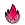 Heat Source
            

            
A volumetric heat source box for an indoor ventilation case (transported temperature scalar).

        

    </a>
    <a href="components/Momentum_Source.md" style="text-decoration: none;">
        

            

                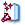 Momentum Source
            

            
A fan/jet momentum source (mean velocity) box for an indoor ventilation case.

        

    </a>
    <a href="components/Viral_Emitter.md" style="text-decoration: none;">
        

            

                 Viral Emitter
            

            
An airborne-pathogen passive-scalar source box for an indoor ventilation case.

        

    </a>

## 07 MRT
#### Main Components

    <a href="components/MRT_Sensors.md" style="text-decoration: none;">
        

            

                 MRT Sensors
            

            
Create comfort sensor probes from a mesh (face centers) or points.

        

    </a>
    <a href="components/MRT_Surface.md" style="text-decoration: none;">
        

            

                 MRT Surface
            

            
Mesh Breps into a tagged radiation surface for an MRT analysis.

        

    </a>
    <a href="components/Surface_Settings.md" style="text-decoration: none;">
        

            

                 Surface Settings
            

            
Thermal + optical material properties for a building/ground MRT surface.

        

    </a>
    <a href="components/Thermal_Comfort.md" style="text-decoration: none;">
        

            

                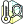 Thermal Comfort
            

            
Compute a thermal comfort metric at a point: UTCI (Ta, RH, wind, MRT), PET (adds the personal inputs), or NOAA Heat Index (Ta, RH only). Pick the metric from the dropdown — the inputs adapt. Wire hourly lists (e.g. EPW series) to compute annual values.

        

    </a>
    <a href="components/Tree_Settings.md" style="text-decoration: none;">
        

            

                 Tree Settings
            

            
Canopy material properties for an MRT tree surface.

        

    </a>
    <a href="components/Vegetation_Settings.md" style="text-decoration: none;">
        

            

                 Vegetation Settings
            

            
Leaf/canopy material properties for an MRT vegetation surface.

        

    </a>
    <a href="components/MRT.md" style="text-decoration: none;">
        

            

                 MRT
            

            
Compute mean radiant temperature at the sensors. Direct-raycast shortwave by default; wire MRT Settings with reflections/diffuse radiation on to use the Radiance DDS engine.

        

    </a>
    <a href="components/MRT_Settings.md" style="text-decoration: none;">
        

            

                 MRT Settings
            

            
Configuration for the MRT + UTCI analysis.

        

    </a>
    <a href="components/Sky_Exposure.md" style="text-decoration: none;">
        

            

                 Sky Exposure
            

            
Computes the Sky View Factor (SVF) for each input point using the Tregenza 145-patch sky subdivision. Casts 145 rays toward the upper hemisphere and returns the fraction of unobstructed sky directions (0 = fully obstructed, 1 = fully open sky).

        

    </a>
    <a href="components/UTCI_Simulation.md" style="text-decoration: none;">
        

            

                 UTCI Simulation
            

            
Compute annual per-probe UTCI from simulation outputs: MRT and wind-speed data trees, plus air temperature and relative humidity. For a weather-only calculator, use "UTCI (Weather)".

        

    </a>
    <a href="components/CalcHeatIndex.md" style="text-decoration: none;">
        

            

                 CalcHeatIndex
            

            
Calculate Heat Index using the NOAA/NWS equation (air temperature + relative humidity).

        

    </a>
    <a href="components/CalcPET.md" style="text-decoration: none;">
        

            

                 CalcPET
            

            
Calculate PET (Physiological Equivalent Temperature) from environmental and personal inputs.

        

    </a>
    <a href="components/UTCI_Weather.md" style="text-decoration: none;">
        

            

                 UTCI Weather
            

            
Universal Thermal Climate Index from weather inputs. Connect an EPW (supplies wind, RH, ambient temp) and/or override Ambient Temp, RH, Wind, and MRT by hand. Item or list.

        

    </a>

## 08 FluidX3D
#### Main Components

    <a href="components/FluidX3D_Run_Settings.md" style="text-decoration: none;">
        

            

                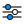 FluidX3D Run Settings
            

            
Solver controls for the FluidX3D GPU engine (memory, simulated time, export interval, and an interactive real-time window).

        

    </a>
    <a href="components/FluidX3D_Run.md" style="text-decoration: none;">
        

            

                 FluidX3D Run
            

            
Prepare and launch a FluidX3D GPU wind simulation (builds the solver from source, runs on the GPU).  LICENSE: FluidX3D (ProjectPhysX) is free for NON-COMMERCIAL use only — public research, education, or personal use. Commercial use is not permitted. See the FluidX3D LICENSE.

        

    </a>

## 10 ML
#### Main Components

    <a href="components/Dataset_Reader.md" style="text-decoration: none;">
        

            

                 Dataset Reader
            

            
Read processed CSV datasets back into Grasshopper. Supports mag_U and all spatial features.

        

    </a>
    <a href="components/ML_Model.md" style="text-decoration: none;">
        

            

                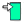 ML Model
            

            
Download an ONNX wind-prediction model from HuggingFace for the Wind Predictor component. Yel 2.0 is public; Esen 1.0 and Poyraz 1.0 need a HuggingFace token. All are 8-channel Wind Predictor models. (Yel 1.0 is a different architecture — the GAN image model used by GAN Predict via its API — and cannot be loaded here.) Models cache in ~/SUS_LAB/ and are reused on subsequent runs.

        

    </a>
    <a href="components/Wind_Predictor.md" style="text-decoration: none;">
        

            

                 Wind Predictor
            

            
Run ONNX wind-field prediction end-to-end. Computes SDF, building height, Zrelative, U/Uref, direction features from geometry, assembles the 8-channel input tensor, runs ONNX inference, and outputs predicted wind speeds. Supports legacy 1ch (U), 2ch (U + k) and new 4ch (U + k + Uroof + kroof) models.

        

    </a>
    <a href="components/Wind_Comfort_Predictor_ML.md" style="text-decoration: none;">
        

            

                 Wind Comfort Predictor ML
            

            
Calculate Pedestrian Wind Comfort using predicted wind fields from the ONNX model.

        

    </a>
    <a href="components/GAN_Predict.md" style="text-decoration: none;">
        

            

                 GAN Predict
            

            
Predict a pedestrian wind-speed field from buildings using the Eddy3D GAN (no CFD run). Sends the geometry to the GAN API and returns wind speeds + a colored result mesh.

        

    </a>
    <a href="components/Interpolate_UMag.md" style="text-decoration: none;">
        

            

                 Interpolate UMag
            

            
Resample per-direction wind-magnitude fields onto a new point grid (nearest-neighbour average, with per-direction rotation). Prepares grids for GAN applications.

        

    </a>

## 12 Outdoor+ Regions
#### Main Components

    <a href="components/Air_Region.md" style="text-decoration: none;">
        

            

                 Air Region
            

            
Create an air region for the UMF case. OutdoorPlus

        

    </a>
    <a href="components/Building_Region.md" style="text-decoration: none;">
        

            

                 Building Region
            

            
Build a solid building region for the UMF case: from the façade surface meshes, two material wall layers (outer + inner) are extruded inward to model heat and moisture transport through the building envelope.

        

    </a>
    <a href="components/Terrain_Region.md" style="text-decoration: none;">
        

            

                 Terrain Region
            

            
Create a terrain region with materials and depth settings. OutdoorPlus

        

    </a>
    <a href="components/Vegetation_Region.md" style="text-decoration: none;">
        

            

                 Vegetation Region
            

            
Create a vegetation region with properties and mesh settings. OutdoorPlus

        

    </a>
    <a href="components/ABL_Condition.md" style="text-decoration: none;">
        

            

                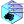 ABL Condition
            

            
Define atmospheric boundary layer settings for the air region. OutdoorPlus

        

    </a>
    <a href="components/Advanced_Terrain_Mesh.md" style="text-decoration: none;">
        

            

                 Advanced Terrain Mesh
            

            
Generate a multi-resolution terrain mesh from input geometry with a solid base. OutdoorPlus

        

    </a>
    <a href="components/Building_Mesh_Settings.md" style="text-decoration: none;">
        

            

                 Building Mesh Settings
            

            
Configure mesh refinement for building regions.

        

    </a>
    <a href="components/Terrain_Mesh_Settings.md" style="text-decoration: none;">
        

            

                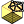 Terrain Mesh Settings
            

            
Configure mesh settings for terrain and underground regions. OutdoorPlus

        

    </a>
    <a href="components/Vegetation_Mesh_Settings.md" style="text-decoration: none;">
        

            

                 Vegetation Mesh Settings
            

            
Configure mesh refinement for vegetation regions. OutdoorPlus

        

    </a>
    <a href="components/Building_Material.md" style="text-decoration: none;">
        

            

                 Building Material
            

            
Select a building material from the list and override its properties.

        

    </a>
    <a href="components/Soil_Material.md" style="text-decoration: none;">
        

            

                 Soil Material
            

            
Define soil material properties for terrain layers. OutdoorPlus

        

    </a>
    <a href="components/Terrain_Surface_Material.md" style="text-decoration: none;">
        

            

                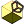 Terrain Surface Material
            

            
Select a terrain surface material from the list and override its properties. OutdoorPlus

        

    </a>
    <a href="components/Vegetation_Properties.md" style="text-decoration: none;">
        

            

                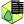 Vegetation Properties
            

            
Define vegetation property coefficients for canopy modeling. OutdoorPlus

        

    </a>
    <a href="components/Grass.md" style="text-decoration: none;">
        

            

                 Grass
            

            
Define grass patches and parameters for the terrain. OutdoorPlus

        

    </a>

## 13 Outdoor+ Simulation
#### Main Components

    <a href="components/Outdoor+_Case.md" style="text-decoration: none;">
        

            

                 Outdoor+ Case
            

            
Create, read, and manage an Outdoor+ (UMF microclimate) case. OutdoorPlus

        

    </a>
    <a href="components/Box_Domain.md" style="text-decoration: none;">
        

            

                 Box Domain
            

            
Define simulation domain extents and refinement padding. OutdoorPlus

        

    </a>
    <a href="components/Relative_Humidity.md" style="text-decoration: none;">
        

            

                 Relative Humidity
            

            
Convert specific humidity (w) and temperature (T) to relative humidity (%). OutdoorPlus

        

    </a>
    <a href="components/Simulation_Mesh_Settings.md" style="text-decoration: none;">
        

            

                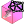 Simulation Mesh Settings
            

            
Configure snappyHexMesh settings for the simulation. OutdoorPlus

        

    </a>
    <a href="components/Simulation_Settings.md" style="text-decoration: none;">
        

            

                 Simulation Settings
            

            
Configure simulation control settings for UMF. OutdoorPlus

        

    </a>
    <a href="components/Timing_Parameters.md" style="text-decoration: none;">
        

            

                 Timing Parameters
            

            
Define simulation timing and optional weather-driven time series. OutdoorPlus

        

    </a>
    <a href="components/Weather.md" style="text-decoration: none;">
        

            

                 Weather
            

            
Read an EPW file and create a Weather object for the simulation. OutdoorPlus

        

    </a>
    <a href="components/CheckMesh.md" style="text-decoration: none;">
        

            

                 CheckMesh
            

            
Run the OpenFOAM checkMesh command for a case region. OutdoorPlus

        

    </a>
    <a href="components/Check_Geometry.md" style="text-decoration: none;">
        

            

                 Check Geometry
            

            
Tests for buildings and trees for Eddy3D-OutdoorPlus simulation.

        

    </a>
    <a href="components/Parse_Case_Logs.md" style="text-decoration: none;">
        

            

                 Parse Case Logs
            

            
Parses log files in a case folder and reports any FOAM errors. OutdoorPlus

        

    </a>
    <a href="components/ViewFactors.md" style="text-decoration: none;">
        

            

                 ViewFactors
            

            
Configure the view-factor discretization for radiation modeling. OutdoorPlus

        

    </a>
    <a href="components/Deconstruct_Weather.md" style="text-decoration: none;">
        

            

                 Deconstruct Weather
            

            
Deconstruct a Weather object into hourly time series values. OutdoorPlus

        

    </a>
    <a href="components/Case_Run.md" style="text-decoration: none;">
        

            

                 Case Run
            

            
Prepare and run a UMF case. OutdoorPlus

        

    </a>
    <a href="components/OpenFOAM_Dictionary.md" style="text-decoration: none;">
        

            

                 OpenFOAM Dictionary
            

            
Create an OpenFOAM dictionary for file modification inputs.

        

    </a>
    <a href="components/OpenFOAM_List.md" style="text-decoration: none;">
        

            

                 OpenFOAM List
            

            
Create an OpenFOAM list for file modification inputs.

        

    </a>
    <a href="components/Read_OpenFOAM_Case.md" style="text-decoration: none;">
        

            

                 Read OpenFOAM Case
            

            
Read an OpenFOAM case directory and list its file containers.

        

    </a>

## 14 Post
#### Main Components

    <a href="components/Export_to_Visualizer.md" style="text-decoration: none;">
        

            

                 Export to Visualizer
            

            
Write probed wind results as a CSV for the Eddy3D Visualizer (viz.eddy3d.com): columns X, Y, Z_relative, U_at_z, mag_U — one row per probe point. Upload the file at https://viz.eddy3d.com to view the 3D field, coloured by velocity magnitude.

        

    </a>
    <a href="components/Open_In_ParaView.md" style="text-decoration: none;">
        

            

                 Open In ParaView
            

            
Open a wind case's direction cases in ParaView. All directions are added to the ParaView pipeline browser; click Apply on the ones you want to load (nothing is loaded automatically).

        

    </a>
    <a href="components/Deconstruct_Case.md" style="text-decoration: none;">
        

            

                 Deconstruct Case
            

            
Inspect any Eddy3D case: Outdoor wind study, Indoor case, or OutdoorPlus (UMF) case.

        

    </a>
    <a href="components/Deconstruct_Region.md" style="text-decoration: none;">
        

            

                 Deconstruct Region
            

            
Deconstruct a MetaFOAM Region instance.

        

    </a>
    <a href="components/Face_Warnings.md" style="text-decoration: none;">
        

            

                 Face Warnings
            

            
Visualize faces that fail tet decomposition during topoSet. OutdoorPlus

        

    </a>
    <a href="components/Read_Cells.md" style="text-decoration: none;">
        

            

                 Read Cells
            

            
Read cell connectivity and cell zones for a region. OutdoorPlus

        

    </a>
    <a href="components/Read_checkMesh.md" style="text-decoration: none;">
        

            

                 Read checkMesh
            

            
Read and visualize sets produced by checkMesh. OutdoorPlus

        

    </a>
    <a href="components/Create_Mesh.md" style="text-decoration: none;">
        

            

                 Create Mesh
            

            
Create a visualization mesh from polyMesh point/face data. OutdoorPlus

        

    </a>
    <a href="components/Create_OBJ.md" style="text-decoration: none;">
        

            

                 Create OBJ
            

            
Export an OBJ mesh from a polyMesh description. OutdoorPlus

        

    </a>
    <a href="components/Cull_Ground_Mesh.md" style="text-decoration: none;">
        

            

                 Cull Ground Mesh
            

            
Remove ground mesh faces that intersect buildings, creating an analysis ground mesh with building footprints cut out.

        

    </a>

