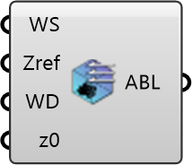

##  ABL Condition

Define atmospheric boundary layer settings for the air region. OutdoorPlus

#### Input
* ##### WS 
Wind speed at the reference height (m/s). Optional; default is 1.
* ##### Zref 
Reference height for wind speed (m). Optional; default is 10.
* ##### WD 
Wind direction as a unit vector. Optional; default is (0, 1, 0).
* ##### z0 
Surface roughness length (m). Optional; default is 0.

#### Output
* ##### ABL
Atmospheric boundary layer settings for the air region.