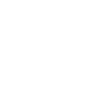

#  [[source code]](https://github.com/Eddy3D-Dev/Eddy3D/search?q=%22Analysis%20Period%22)

Define an analysis period (from/to day of year, start/end hour of day) and output the hour-of-year indices it covers, for filtering annual results.

#### Input
* ##### From (F) 
From day of year [1-365].
* ##### To (T) 
To day of year [1-365].
* ##### Start (S) 
Start hour of day [1-24].
* ##### End (E) 
End hour of day [1-24].

#### Output
* ##### HOY
Hour-of-year indices in the period.
* ##### Date
The corresponding DateTime values.