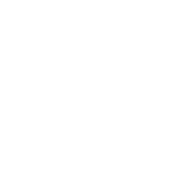

##  [[source code]](https://github.com/Eddy3D-Dev/Eddy3D/search?q=%22Atmospheric%20Boundary%20Layer%22)

Define atmospheric boundary layer inflow conditions for Eddy3D.

#### Input
* ##### Dirs 
Wind directions as meteorological degrees (wind-from, clockwise from north) or flow vectors. One solver case is created per direction. Optional; default is flow toward +X.
* ##### Wind Speed (U) 
Wind speed at the reference height (m/s), one value per wind direction. A single value applies to all directions; a shorter list repeats its last value. Optional; default is 5.
* ##### Zref 
Reference height for wind speed (m). Optional; default is 10.
* ##### z0 
Aerodynamic roughness length (m). Higher values indicate rougher terrain. Optional; default is 1.
* ##### Zgnd 
Ground/displacement height for the ABL log-law profile (m). Optional; default is 0.
* ##### k 
Inlet/initial turbulent kinetic energy k (m^2/s^2) for the ABL. Used by the k field and the turbulence transports; the inlet patch still uses the atmBoundaryLayer k profile. Optional; default is 0.015.
* ##### epsilon 
Inlet/initial turbulent dissipation rate epsilon (m^2/s^3) for the k-epsilon family. The inlet patch still uses the atmBoundaryLayer epsilon profile. Optional; default is 0.135.
* ##### omega 
Inlet/initial specific dissipation rate omega (1/s) for the k-omega SST model. Optional; default is 100.

#### Output
* ##### Boundary Conditions (BC)
Atmospheric boundary layer inflow boundary conditions (including the wind directions); plug into the wind case BC input.
* ##### Vectors
Resolved unit flow vectors, one per wind direction.