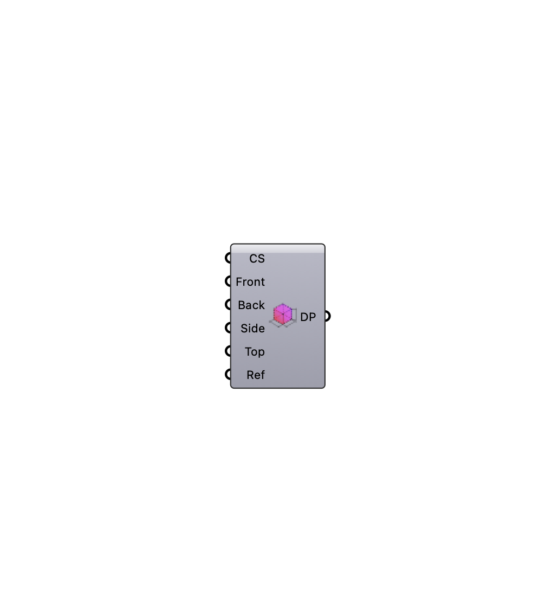

##  [[source code]](https://github.com/Eddy3D-Dev/Eddy3D/search?q=%22Box%20Domain%22)

Define simulation domain extents and refinement padding. OutdoorPlus

#### Input
* ##### Cell Size (CS) 
Base cell size for the domain (model units).
* ##### Front 
Padding in front of the geometry bounding box (model units).
* ##### Back 
Padding behind the geometry bounding box (model units).
* ##### Side 
Padding on the side faces of the geometry bounding box (model units).
* ##### Top 
Padding above the geometry bounding box (model units).
* ##### Ref 
Padding applied to the refinement box around the geometry (model units).

#### Output
* ##### Domain Parameters (DP)
Domain and refinement box parameters as a list.