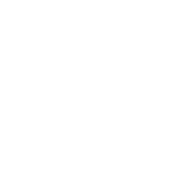

#  Brep Grid Points - [[source code]](https://github.com/Eddy3D-Dev/Eddy3D/search?q=%22Brep%20Grid%20Points%22)

Generate a regular point grid on Brep, surface, or mesh geometry.

#### Input
* ##### Geo 
Brep, surface, or mesh geometry to sample.
* ##### Space 
Grid spacing in model units (meters). Optional; default is 10.

#### Output
* ##### Pts
Generated grid points on the input geometry.
* ##### Status
Status message or warnings.