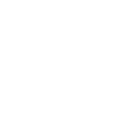

##  [[source code]](https://github.com/Eddy3D-Dev/Eddy3D/search?q=%22Building%20Material%22)

Select a building material from the list and override its properties.

#### Input
* ##### Mat 
Select a material from the list.
* ##### Rho 
Material density (rho). Optional; default is 1600.
* ##### Cap 
Heat capacity (cap). Optional; default is 1000.
* ##### Lam1 
Primary thermal conductivity (lambda1). Optional; default is 0.682.
* ##### Lam2 
Secondary thermal conductivity (lambda2). Optional; default is 0.0.

#### Output
* ##### Mat
Building material settings.