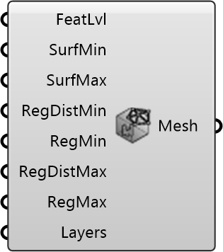

##  Building Mesh Settings

Configure mesh refinement for building regions.

#### Input
* ##### FeatLvl 
Feature refinement level for extracted edges. Optional; default is 4.
* ##### SurfMin 
Minimum surface refinement level. Optional; default is 3.
* ##### SurfMax 
Maximum surface refinement level. Optional; default is 3.
* ##### Layers 
Number of prism layers to add. Optional; default is 2.

#### Output
* ##### Mesh
Building mesh settings for snappyHexMesh.