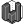
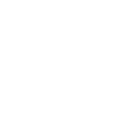

#  Building Region - [[source code]](https://github.com/Eddy3D-Dev/Eddy3D/search?q=%22Building%20Region%22)

Build a solid building region for the UMF case: from the façade surface meshes, two material wall layers (outer + inner) are extruded inward to model heat and moisture transport through the building envelope.

#### Input
* ##### Mesh 
Building façade surface meshes. The wall layers are extruded inward from these surfaces, so supply the outer building surfaces (not closed solids).
* ##### Outer Material (OM) 
Material of the outer wall layer — the façade-side layer extruded inward from the mesh.
* ##### Inner Material (IM) 
Material of the inner wall layer — the interior-side layer behind the outer layer.
* ##### Outer Thickness (OT) 
Thickness of the outer wall layer, in meters. Optional; default is 0.1.
* ##### Inner Thickness (IT) 
Thickness of the inner wall layer, in meters. Optional; default is 0.1.
* ##### MeshSet 
Mesh refinement settings for the building region (from the Building Mesh Settings component).
* ##### Building Temperature (BT) 
Constant interior room temperature (°C), imposed as the inner-wall boundary condition for the whole run. Optional; default is 22.

#### Output
* ##### Building
The building solid region; connect it to the UMF Case component's Building Region input.