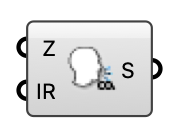

##  CO2 Emitter

A CO2 passive-scalar source box for an indoor ventilation case.

#### Input
* ##### Z 
Box zone occupied by the CO2 source.
* ##### IR 
CO2 injection rate (specific).

#### Output
* ##### S
CO2 source for the Indoor Case component.