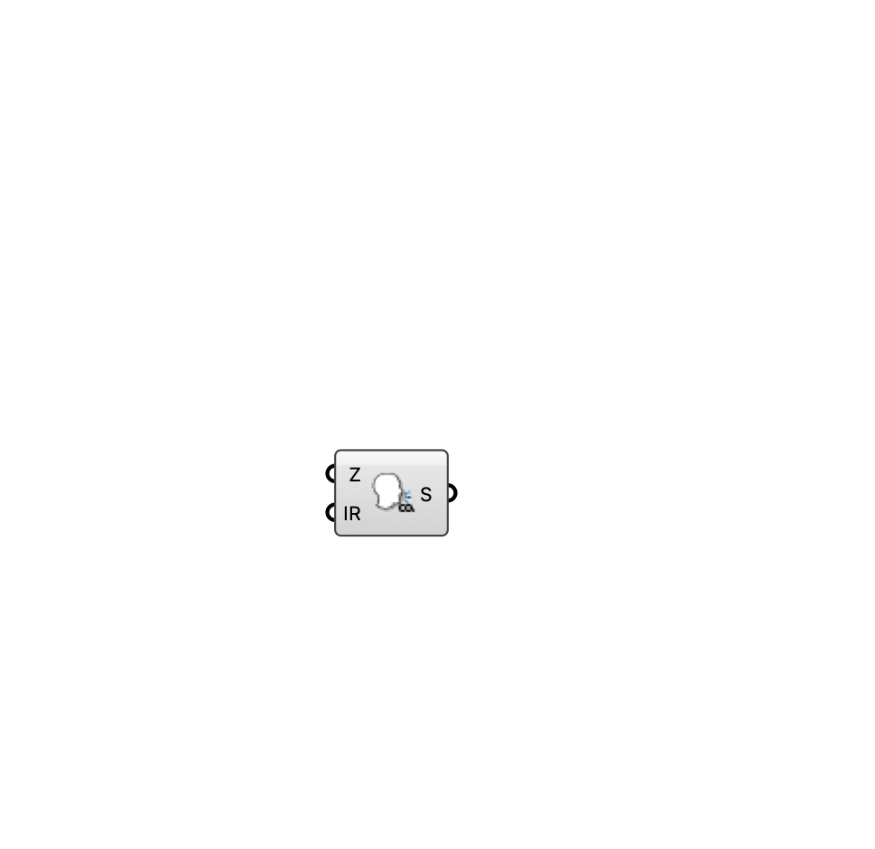

##  [[source code]](https://github.com/Eddy3D-Dev/Eddy3D/search?q=%22CO2%20Emitter%22)

A CO2 passive-scalar source box for an indoor ventilation case.

#### Input
* ##### Zone (Z) 
Box zone occupied by the CO2 source.
* ##### Injection Rate (IR) 
CO2 injection rate (specific).

#### Output
* ##### Source (S)
CO2 source for the Indoor Case component.