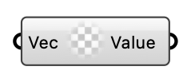

#  Calculated Vector Value - [[source code]](https://github.com/Eddy3D-Dev/Eddy3D/search?q=%22Calculated%20Vector%20Value%22)

Create a calculated vector Value.

#### Input
* ##### Vec 
Vector value to assign.

#### Output
* ##### Value
Calculated Vector Value instance.