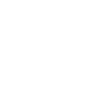

#  Case Run - [[source code]](https://github.com/Eddy3D-Dev/Eddy3D/search?q=%22Case%20Run%22)

Prepare and run a UMF case. OutdoorPlus

#### Input
* ##### Case 
Case to prepare and/or run.
* ##### Prep 
Prepare meshing and case setup.
* ##### Run 
Run the simulation solver.
* ##### Parallel 
Run the case in parallel if enabled.

#### Output
* ##### Case
Updated case after prepare/run.
* ##### Logs
Latest execution logs.