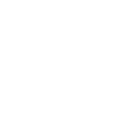

##  [[source code]](https://github.com/Eddy3D-Dev/Eddy3D/search?q=%22Cell%20Size%22)

Compute the snappyHexMesh refinement level needed to reach a target cell size (each level halves the cell size).

#### Input
* ##### Base 
Base cell size of the background mesh (meters).
* ##### Target 
Desired final cell size at the highest refinement level (meters).

#### Output
* ##### Level
Refinement level (n) required to reach the target cell size.
* ##### Level+1
One level higher than required (finer resolution).