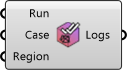

##  CheckMesh

Run the OpenFOAM checkMesh command for a case region. OutdoorPlus  Version 1.0.0.827

#### Input
* ##### Run 
Run the checkMesh command.
* ##### Case 
UMF case instance to check.
* ##### Region 
Region name to check.

#### Output
* ##### Logs
Log output from the checkMesh command.