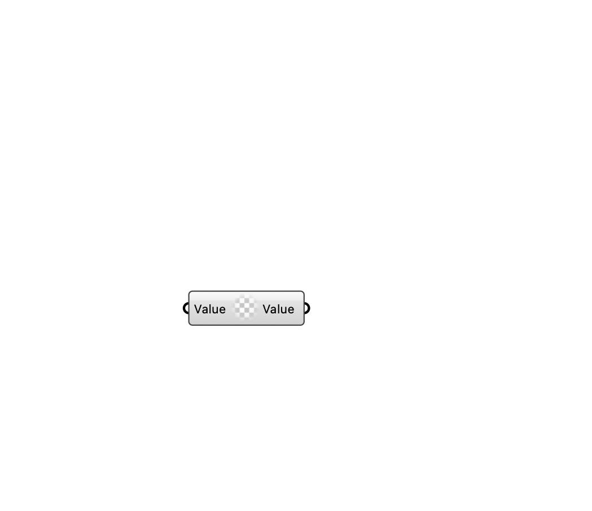

#  [[source code]](https://github.com/Eddy3D-Dev/Eddy3D/search?q=%22Constant%20Value%22)

Create a constant scalar Value.

#### Input
* ##### Value 
Scalar value to assign.

#### Output
* ##### Value
Constant Value instance.