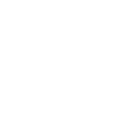

#  Create Mesh - [[source code]](https://github.com/Eddy3D-Dev/Eddy3D/search?q=%22Create%20Mesh%22)

Create a visualization mesh from polyMesh point/face data. OutdoorPlus

#### Input
* ##### Case 
UMF case used to locate the mesh data.
* ##### Region 
Region name to visualize.
* ##### Faces 
Optional face indices to visualize.
* ##### Run 
Generate the mesh when true.

#### Output
* ##### Mesh
Generated unified mesh.
* ##### Data
Geometric and topological mesh data.
* ##### FaceCount
Total face count in the polyMesh.
* ##### PointCount
Total point count in the polyMesh.