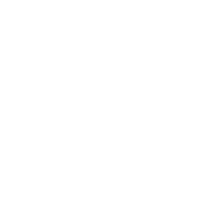

#  Create OBJ - [[source code]](https://github.com/Eddy3D-Dev/Eddy3D/search?q=%22Create%20OBJ%22)

Export an OBJ mesh from a polyMesh description. OutdoorPlus

#### Input
* ##### Data 
Geometric and topological mesh data (UMFMesh).
* ##### File 
Output OBJ file name or path.
* ##### Faces 
Optional face indices to include in the OBJ.
* ##### Write 
Write the OBJ file when true.

#### Output
* ##### Info
OBJ export result message.
* ##### Data
Geometric and topological mesh data.