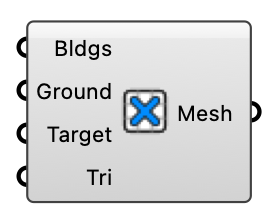

##  Cull Ground Mesh

Remove ground mesh faces that intersect buildings, creating an analysis ground mesh with building footprints cut out.

#### Input
* ##### Bldgs 
Joined building mesh for intersection.
* ##### Ground 
Ground mesh to cull. Consider QuadRemesh for control.
* ##### Target 
Target number of faces in the output mesh. Default: 50000.
* ##### Tri 
Convert quads to triangles in the output. Default: true.

#### Output
* ##### Mesh
Ground mesh with building footprints removed.