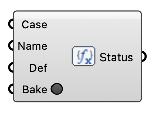

##  Custom Function Object

Inject a custom OpenFOAM function object into a written case so the solver runs it at runtime — fieldAverage, yPlus, wallShearStress, forces, surfaceFieldValue, a coded FO, etc.  Version 1.0.0.827

#### Input
* ##### Case 
The written wind case / loaded study to add the function object to.
* ##### Name 
Function object key (a valid OpenFOAM word, e.g. "fieldAverage1").
* ##### Def 
The function object body — the contents between its braces, as text (from a panel) or a Foamonary. Example:   type            fieldAverage;   libs            ("libfieldFunctionObjects.so");   fields          ( U p ); The component wraps it as Name { ... } inside controlDict functions.
* ##### Bake 
Write the function object into each case's controlDict (idempotent). Do this before running the solve; momentary button.

#### Output
* ##### Status
What was baked, and into how many cases.