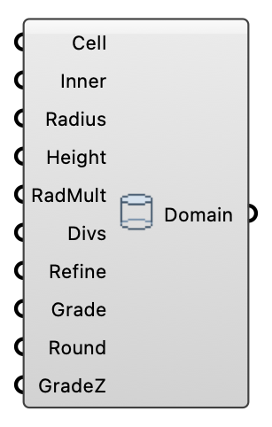

#  Cylinder Domain - [[source code]](https://github.com/Eddy3D-Dev/Eddy3D/search?q=%22Cylinder%20Domain%22)

Define a cylindrical simulation domain for Eddy3D. One cylindrical mesh serves all wind directions; the cylinder side faces switch between inlet and outlet per direction.

#### Input
* ##### Cell 
Cell size of the inner core blocks in meters. Default: 25.
* ##### Inner 
Half-size of the square inner core in meters. -1 = auto from the building footprint.
* ##### Radius 
Outer radius of the cylindrical domain in meters. -1 = auto from the building height.
* ##### Height 
Height of the cylindrical domain in meters. -1 = auto from the building height.
* ##### RadMult 
Cell growth factor from the core toward the perimeter. Default: 2.
* ##### Divs 
Cells per core block (and per perimeter segment, tangentially). Refines the core without changing the block layout that Core Cell Size sets; the preview core grid densifies to match. Default: 1.
* ##### Refine 
Padding of the refinement box around the geometry (m). -1 = auto: 27.5% of the building footprint.
* ##### Grade 
Far-field cell coarsening across the perimeter ring (outer cell size / inner cell size). 1 = uniform; >1 keeps fine cells at the buildings but grows the outer cells. The default 7 coarsens the far field aggressively (far fewer cells downwind); lower it (1-3) for a gentler, more uniform ring. Default: 7.
* ##### Round 
Rounds the O-grid inner core from a square (0) toward a circle (1). Higher values even out the radial gap to the outer boundary, cutting the corner non-orthogonality of the square core. 0 keeps the classic square core. 0.65 is the checkMesh-sweep optimum (lowest max non-orthogonality across mesh resolutions; skewness stays well within limits). Default: 0.65.
* ##### GradeZ 
Vertical cell expansion ratio (top cell size / bottom cell size). 1 = uniform; >1 keeps fine cells near the ground and coarsens aloft (typical for an ABL). A checkMesh sweep showed non-orthogonality/skewness are unaffected by this; the only cost is background aspect ratio. The default 35 strongly refines the near-ground layer; ease it down if convergence struggles. Default: 35.

#### Output
* ##### Domain
Cylindrical domain parameters (-1 entries mean auto-sized from the building geometry); plug into the wind case Domain input.