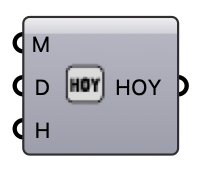

##  Date to HOY

Convert a date and time (month, day, hour) into a single hour-of-year integer (1–8760), for indexing annual hourly data.

#### Input
* ##### M 
Month [1-12].
* ##### D 
Day [1-31].
* ##### H 
Hour [0-23].

#### Output
* ##### HOY
Hour of year [1-8760].