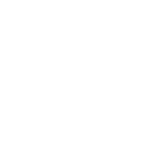

##  [[source code]](https://github.com/Eddy3D-Dev/Eddy3D/search?q=%22Date%20to%20HOY%22)

Convert a date and time (month, day, hour) into a single hour-of-year integer (1–8760), for indexing annual hourly data.

#### Input
* ##### Month (M) 
Month [1-12].
* ##### Day (D) 
Day [1-31].
* ##### Hour (H) 
Hour [0-23].

#### Output
* ##### HOY
Hour of year [1-8760].