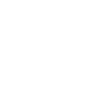

#  [[source code]](https://github.com/Eddy3D-Dev/Eddy3D/search?q=%22Debugger%22)

Internal debugging helper (not for general use).

#### Input
* ##### Path 
Path to an OpenFOAM dictionary file.
* ##### Aux 
Optional secondary path (unused).

#### Output
* ##### StartFace
Parsed startFace value.
* ##### Debug
Reserved debug output.