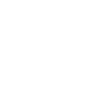

#  Deconstruct Case - [[source code]](https://github.com/Eddy3D-Dev/Eddy3D/search?q=%22Deconstruct%20Case%22)

Inspect any Eddy3D case: Outdoor wind study, Indoor case, or OutdoorPlus (UMF) case.

#### Input
* ##### Case (C) 
Any Eddy3D case: an Outdoor wind study, an Indoor case, or an OutdoorPlus (UMF) case.

#### Output
* ##### Name (N)
Case name.
* ##### Type (T)
Which plugin produced it (Outdoor / Indoor / OutdoorPlus).
* ##### Geometry (G)
Representative geometry (buildings / room / total mesh).
* ##### Domain (D)
Simulation domain (wind tunnel box / indoor zone).
* ##### Case Folders (F)
Case directories on disk (one per sub-result).
* ##### Sub-Results (S)
Sub-result labels (wind directions for Outdoor; the case name otherwise).
* ##### Regions (R)
Regions available to probe (air, buildings, … for UMF; a single empty entry otherwise).