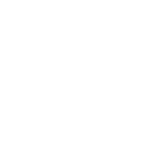

##  [[source code]](https://github.com/Eddy3D-Dev/Eddy3D/search?q=%22Deconstruct%20Entry%22)

Deconstructs an Entry instance.

#### Input
* ##### Entry 
Entry to deconstruct.

#### Output
* ##### Address
Entry address.
* ##### Content
Content of the entry as key/value pairs.