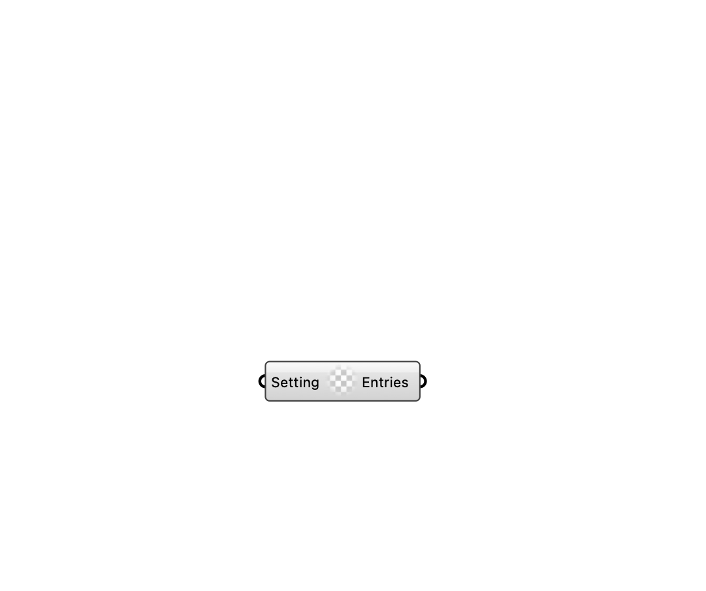

#  [[source code]](https://github.com/Eddy3D-Dev/Eddy3D/search?q=%22Deconstruct%20Setting%22)

Deconstruct a Setting instance into its entries.

#### Input
* ##### Setting 
Setting to deconstruct.

#### Output
* ##### Entries
Entries contained in the setting.