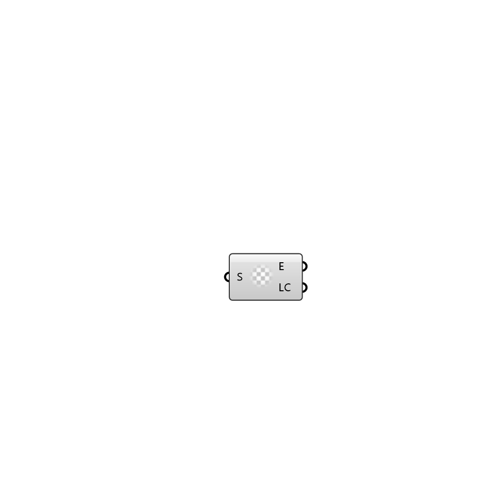

##  Deconstruct Setting - [[source code]](https://github.com/Eddy3D-Dev/Eddy3D-UMCF/blob/release/UMCF/CMP/Meta/DeconstructSettingCMP.cs)

Deconstrusct a setting instance.

#### Input
* ##### S
Setting to deconstruct

#### Output
* ##### E
Entries in the setting.
* ##### LC
List containers in the setting