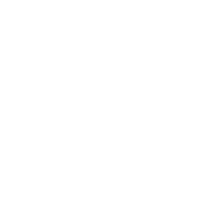

##  [[source code]](https://github.com/Eddy3D-Dev/Eddy3D/search?q=%22Deconstruct%20Weather%22)

Deconstruct a Weather object into hourly time series values. OutdoorPlus

#### Input
* ##### Weather 
Weather object, or an EPW file path (e.g. from Download Weather), to deconstruct.
* ##### Fields (F) 
Pick which weather fields to output. Tick to add an output, untick to remove. All 17 are available.

#### Output
* ##### DBT
Hourly dry-bulb temperature (deg C).
* ##### Relative Humidity (RH)
Hourly relative humidity (%).
* ##### Wind Speed (WS)
Hourly wind speed (m/s).
* ##### Wind Direction (WD)
Hourly wind direction (deg).