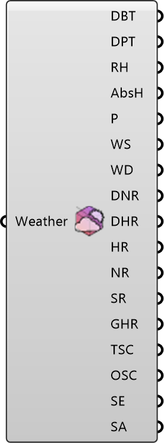

##  Deconstruct Weather

Deconstruct a Weather object into hourly time series values. OutdoorPlus  Version 1.0.0.827

#### Input
* ##### Weather 
Weather object, or an EPW file path (e.g. from Download Weather), to deconstruct.
* ##### F 
Pick which weather fields to output. Tick to add an output, untick to remove. All 17 are available.

#### Output
* ##### DBT
Hourly dry-bulb temperature (deg C).
* ##### RH
Hourly relative humidity (%).
* ##### WS
Hourly wind speed (m/s).
* ##### WD
Hourly wind direction (deg).