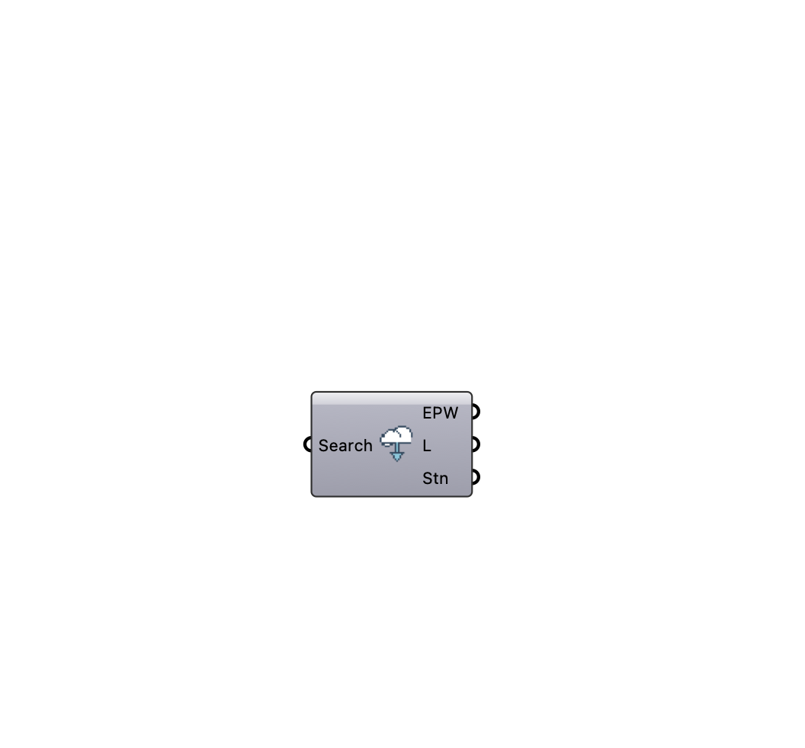

#  [[source code]](https://github.com/Eddy3D-Dev/Eddy3D/search?q=%22Download%20Weather%22)

Download an EPW weather file from climate.onebuilding.org nearest to your project location. Use the Search input to filter by station name, WMO ID, or dataset year.

#### Input
* ##### Search 
Station name, WMO ID, country, state, or dataset year (e.g. 'New York', '725030', '2009-2023').

#### Output
* ##### EPW
Path to the downloaded EPW weather file.
* ##### Logs (L)
Execution log.
* ##### Stn
Stations matching the search filter.