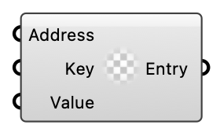

#  Entry from a Key and Value - [[source code]](https://github.com/Eddy3D-Dev/Eddy3D/search?q=%22Entry%20from%20a%20Key%20and%20Value%22)

Create an Entry from address, key, and value (not yet implemented).

#### Input
* ##### Address 
Address where the entry will modify or add content.
* ##### Key 
Entry key.
* ##### Value 
Entry value.

#### Output
* ##### Entry
Created entry (placeholder).