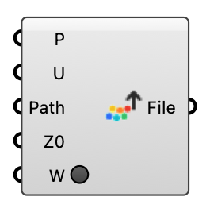

##  Export to Visualizer

Write probed wind results as a CSV for the Eddy3D Visualizer (viz.eddy3d.com): columns X, Y, Z_relative, U_at_z, mag_U — one row per probe point. Upload the file at https://viz.eddy3d.com to view the 3D field, coloured by velocity magnitude.  Version 1.0.0.827

#### Input
* ##### P 
Probe points; their X, Y, Z become the CSV coordinates.
* ##### U 
Velocity vector at each point (e.g. the Probe component's U output). Its length becomes mag_U (and U_at_z). Optional — without it the points export with zero magnitude.
* ##### Path 
Output .csv path. This is the file you upload to the Eddy3D Visualizer.
* ##### Z0 
Ground height [m] subtracted from each point's Z to give Z_relative. Default 0.
* ##### W 
Write the CSV. Momentary — resets after the file is written.

#### Output
* ##### File
The written CSV path.