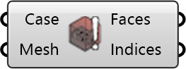

##  Face Warnings

Visualize faces that fail tet decomposition during topoSet. OutdoorPlus

#### Input
* ##### Case 
UMF case containing the prepare log.
* ##### Mesh 
Simulation domain mesh.

#### Output
* ##### Faces
Mesh faces flagged in warning logs.
* ##### Indices
Face indices with no base point found for a valid tet decomposition.