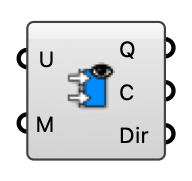

##  Flow Rates

Compute volumetric flow rates (m³/s) across a mesh, treating its vertices as velocity probes. Per face: average vertex velocities × face area × cos(angle to face normal).

#### Input
* ##### U 
Velocity vectors, one per mesh vertex (e.g. probed pedestrian-height wind).
* ##### M 
Mesh whose faces the flow is integrated over.

#### Output
* ##### Q
Volumetric flow rate per face (m³/s).
* ##### C
Face centers.
* ##### Dir
Average velocity vector per face.