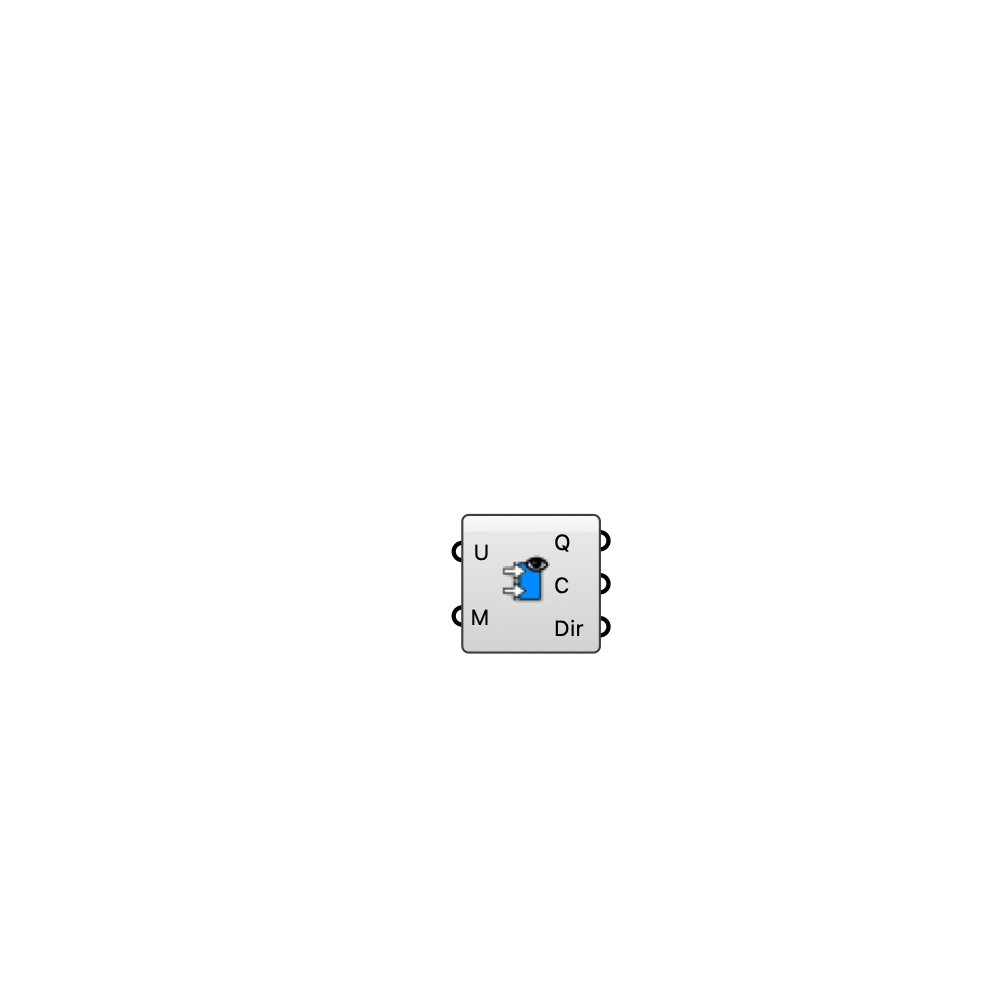

##  [[source code]](https://github.com/Eddy3D-Dev/Eddy3D/search?q=%22Flow%20Rates%22)

Compute volumetric flow rates (m³/s) across a mesh, treating its vertices as velocity probes. Per face: average vertex velocities × face area × cos(angle to face normal).

#### Input
* ##### Velocity (U) 
Velocity vectors, one per mesh vertex (e.g. probed pedestrian-height wind).
* ##### Mesh (M) 
Mesh whose faces the flow is integrated over.

#### Output
* ##### Flow Rates (Q)
Volumetric flow rate per face (m³/s).
* ##### Centers (C)
Face centers.
* ##### Dir
Average velocity vector per face.