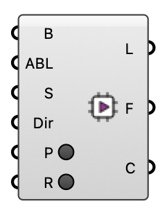

##  FluidX3D Run

Prepare and launch a FluidX3D GPU wind simulation (builds the solver from source, runs on the GPU).  LICENSE: FluidX3D (ProjectPhysX) is free for NON-COMMERCIAL use only — public research, education, or personal use. Commercial use is not permitted. See the FluidX3D LICENSE.  Version 1.0.0.827

#### Input
* ##### B 
Building geometry to voxelize.
* ##### ABL 
ABL inflow from the 'ABL Flow' component — the SAME boundary condition OpenFOAM uses. Supplies reference speed, reference height, roughness length and flow direction. Uses the first wind direction (FluidX3D runs one direction per case).
* ##### S 
FluidX3D run settings (optional; defaults used otherwise).
* ##### Dir 
Working directory (optional; default ~/Eddy3D/FluidX3D).
* ##### P 
Build the case + solver from source (does not launch).
* ##### R 
Prepare (if needed) and launch the GPU solver.

#### Output
* ##### L
Run log / status.
* ##### F
FluidX3D case root folder.
* ##### C
FluidX3D result (VTK directory) — plug into the Probe component's Case input.