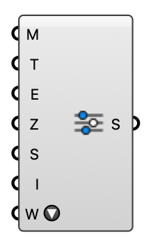

##  FluidX3D Run Settings

Solver controls for the FluidX3D GPU engine (memory, simulated time, export interval, and an interactive real-time window).  Version 1.0.0.827

#### Input
* ##### M 
GPU memory budget (MB).
* ##### T 
Physical simulated time (s).
* ##### E 
VTK export interval (s).
* ##### Z 
Ground plane Z (model units).
* ##### S 
Optional override for the FluidX3D source folder. Leave empty to use the default install path.
* ##### I 
Open FluidX3D's native real-time GPU window (live render, on-the-fly camera + mode keys) instead of headless batch VTK export. No VTK is written in interactive mode — use batch mode to probe results. Windows: full support; macOS: requires XQuartz (X11).
* ##### W 
Interactive real-time window size (macOS X11). "Fullscreen" sizes it to the display. Only applies in interactive mode; on Windows the window is always full-screen.

#### Output
* ##### S
FluidX3D run settings.