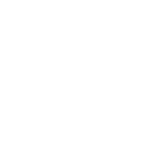

#  GAN Predict - [[source code]](https://github.com/Eddy3D-Dev/Eddy3D/search?q=%22GAN%20Predict%22)

Predict a pedestrian wind-speed field from buildings using the Eddy3D GAN (no CFD run). Sends the geometry to the GAN API and returns wind speeds + a colored result mesh.

#### Input
* ##### Buildings (B) 
Building meshes.
* ##### Pl 
Square analysis plane (defaults to a 512×512 box around the buildings).
* ##### Dir 
Wind direction in degrees (0=N, clockwise).
* ##### URL 
GAN API base URL.
* ##### Voxel Size (V) 
Geometry rasterization voxel size (m).
* ##### Color Size (CS) 
Result-mesh pixel size for coloring.
* ##### Color Map (CM) 
Color map: Viridis, Turbo, or Inferno.
* ##### Run 
Run the prediction. Momentary — resets when the result arrives.

#### Output
* ##### Wind Speed (U)
Predicted pedestrian wind speeds.
* ##### Result Mesh (M)
Colored wind-speed result mesh.