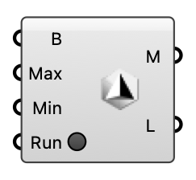

##  Gmsh Mesh

Creates a STL mesh from geometry using the gmsh application. Useful to create healthy mesh topologies for building elements.  Version 1.0.0.827

#### Input
* ##### B 
Brep geometry to mesh
* ##### Max 
Maximum element size. Default value: 1.0.
* ##### Min 
Minimum element size. Default value: 0.5.
* ##### Run 
Run the gmsh process

#### Output
* ##### M
The resulting STL mesh
* ##### L
Execution logs from gmsh