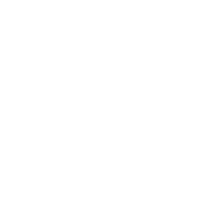

##  [[source code]](https://github.com/Eddy3D-Dev/Eddy3D/search?q=%22Gmsh%20Mesh%22)

Creates a STL mesh from geometry using the gmsh application. Useful to create healthy mesh topologies for building elements.

#### Input
* ##### Brep (B) 
Brep geometry to mesh
* ##### Max 
Maximum element size. Default value: 1.0.
* ##### Min 
Minimum element size. Default value: 0.5.
* ##### Run 
Run the gmsh process

#### Output
* ##### Mesh (M)
The resulting STL mesh
* ##### Logs (L)
Execution logs from gmsh