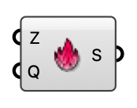

##  Heat Source

A volumetric heat source box for an indoor ventilation case (transported temperature scalar).

#### Input
* ##### Z 
Box zone occupied by the heat source.
* ##### Q 
Temperature source rate injected into the zone (K/s, specific).

#### Output
* ##### S
Heat source for the Indoor Case component.