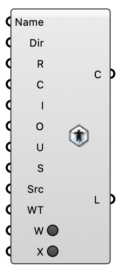

##  Indoor Case

Build an isothermal indoor ventilation case (room + inlets + outlets + sinks) for OpenFOAM 12.  Version 1.0.0.827

#### Input
* ##### Name 
Case name (no spaces).
* ##### Dir 
Working directory (default ~/Eddy3D/Indoor).
* ##### R 
Closed room Brep.
* ##### C 
Mesh cell size (m).
* ##### I 
Inlet surface(s): Brep or Indoor Inlet component(s).
* ##### O 
Outlet surface(s): Brep or Indoor Outlet component(s).
* ##### U 
Fallback inlet speed (m/s) when raw Breps are used. Ignored when Indoor Inlet components provide velocity.
* ##### S 
Momentum sinks (Indoor Sink).
* ##### Src 
Emitters: Momentum / Heat / CO2 / Viral Source components.
* ##### WT 
Optional wall temperature (K) for the transported temperature field (needs a Heat Source).
* ##### W 
Click to write the case to disk. Resets automatically so it never re-writes on recompute.
* ##### X 
Click to delete the case folder. Resets automatically so it never re-deletes on recompute.

#### Output
* ##### C
The indoor case (for the Run component).
* ##### L
Build / write logs.