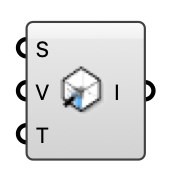

##  Indoor Inlet

Ventilation inlet — defines where air enters the room (diffuser, window, door). Direction is computed perpendicular to the surface, pointing into the room.

#### Input
* ##### S 
Planar surface on the room wall marking the inlet opening.
* ##### V 
Inlet supply speed (m/s). Direction is auto-computed from the surface normal.
* ##### T 
Inlet air temperature (°C).

#### Output
* ##### I
Indoor inlet for the case component.