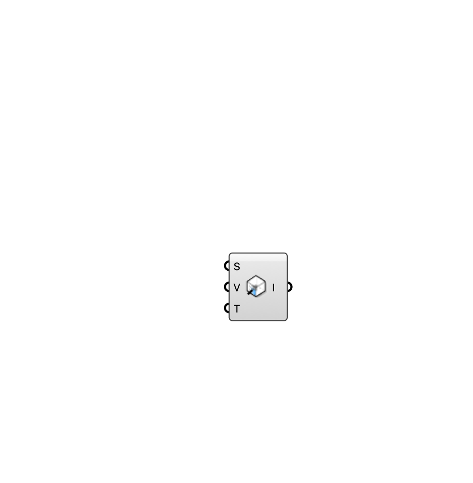

##  [[source code]](https://github.com/Eddy3D-Dev/Eddy3D/search?q=%22Indoor%20Inlet%22)

Ventilation inlet — defines where air enters the room (diffuser, window, door). Direction is computed perpendicular to the surface, pointing into the room.

#### Input
* ##### Surface (S) 
Planar surface on the room wall marking the inlet opening.
* ##### Speed (V) 
Inlet supply speed (m/s). Direction is auto-computed from the surface normal.
* ##### Temperature (T) 
Inlet air temperature (°C).

#### Output
* ##### Inlet (I)
Indoor inlet for the case component.