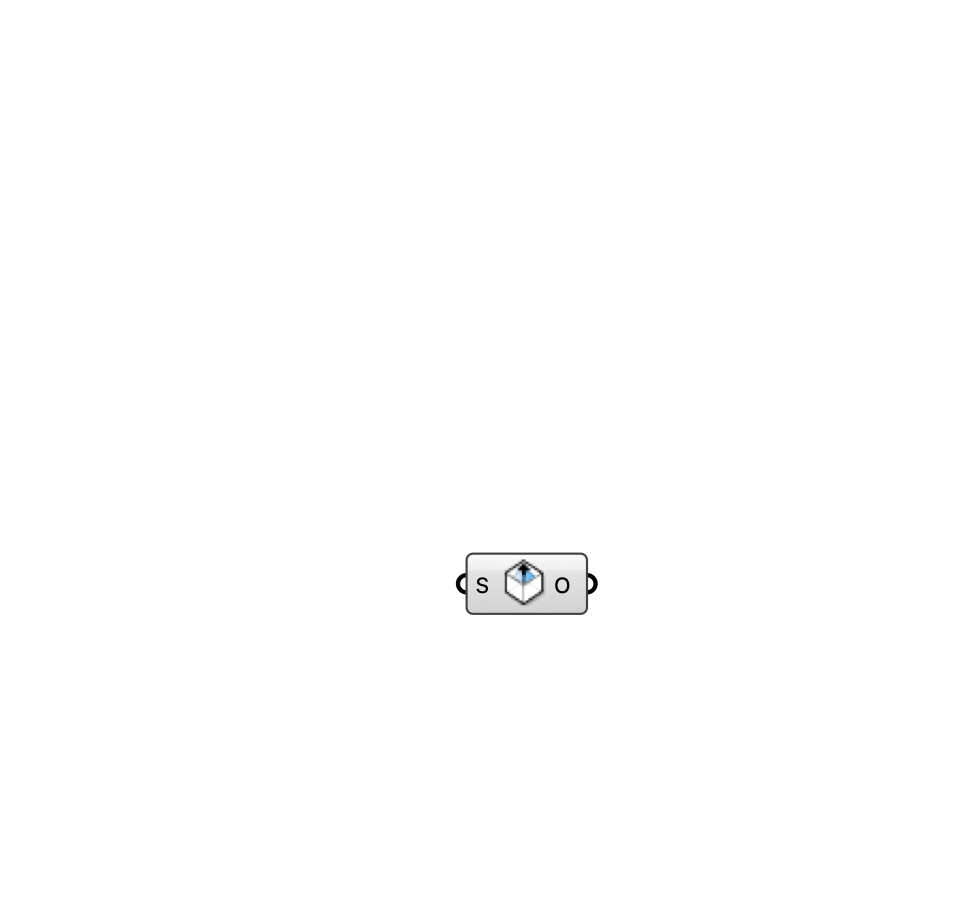

#  [[source code]](https://github.com/Eddy3D-Dev/Eddy3D/search?q=%22Indoor%20Outlet%22)

Ventilation outlet — defines where air exhausts from the room (return grille, open window).

#### Input
* ##### Surface (S) 
Planar surface on the room wall marking the outlet opening.

#### Output
* ##### Outlet (O)
Indoor outlet for the case component.