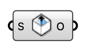

##  Indoor Outlet

Ventilation outlet — defines where air exhausts from the room (return grille, open window).

#### Input
* ##### S 
Planar surface on the room wall marking the outlet opening.

#### Output
* ##### O
Indoor outlet for the case component.