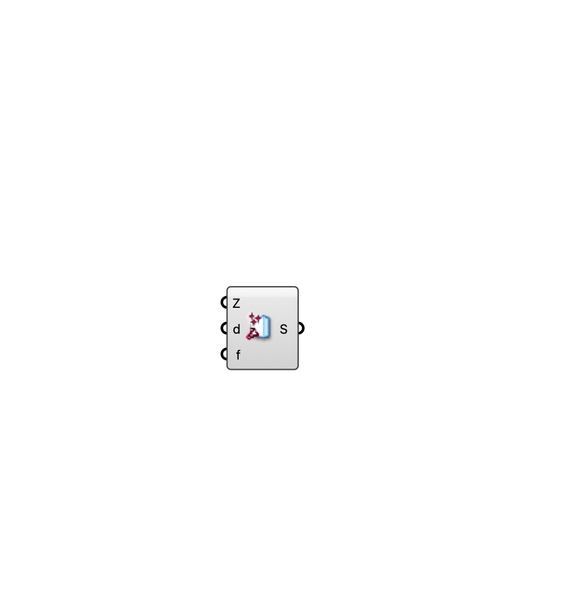

##  [[source code]](https://github.com/Eddy3D-Dev/Eddy3D/search?q=%22Indoor%20Sink%22)

A Darcy-Forchheimer momentum sink (filter/screen) box for an indoor ventilation case.

#### Input
* ##### Zone (Z) 
Box zone occupied by the sink.
* ##### d 
Darcy viscous resistance (1/m²) per axis.
* ##### f 
Forchheimer inertial resistance (1/m) per axis.

#### Output
* ##### Sink (S)
Momentum sink for the indoor case.