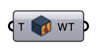

##  Indoor Wall

Set the indoor wall temperature (°C) for the transported temperature field.

#### Input
* ##### T 
Wall temperature (°C).

#### Output
* ##### WT
Wall temperature in Kelvin for the Indoor Case component's Wall Temp input.