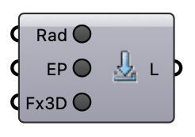

#  Install Engines - [[source code]](https://github.com/Eddy3D-Dev/Eddy3D/search?q=%22Install%20Engines%22)

Downloads and installs Radiance and EnergyPlus v9.4.0 (MRT + UTCI pipeline), and clones the FluidX3D GPU solver source.

#### Input
* ##### Rad 
Click to download and install Radiance.
* ##### Install EnergyPlus (EP) 
Click to download and launch the EnergyPlus v9.4.0 installer.
* ##### Fx3D 
Click to clone the FluidX3D GPU solver source (requires git). Note: FluidX3D is free for NON-COMMERCIAL use only (research/education/personal); commercial use is not permitted.

#### Output
* ##### Logs (L)
Installation log.